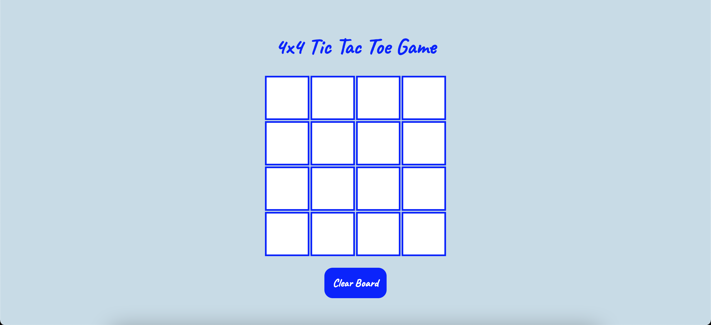
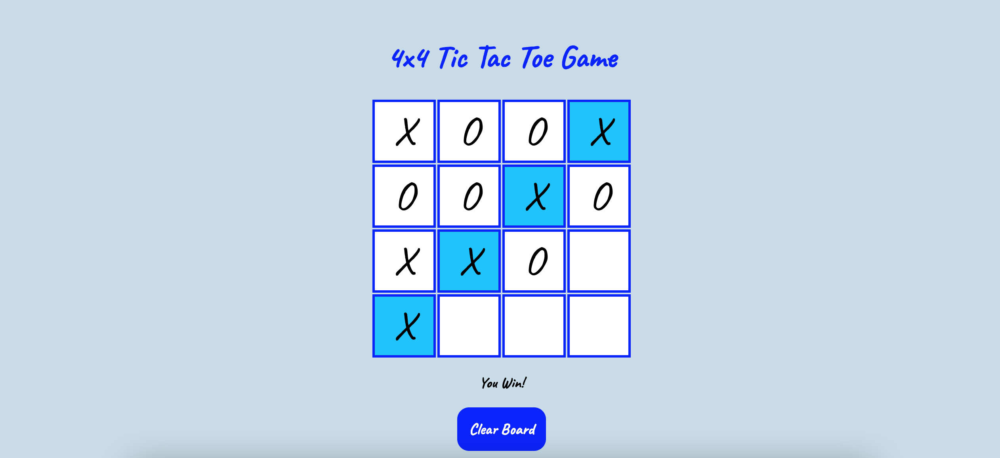

# :x: 4x4 Tic Tac Toe :o:

4x4 Tic Tac Toe game made with HTML, CSS, Javascript.

 

### Gameplay:

    1. The user plays the one side (X) and the    computer plays the other (O).

    2. The players take turns placing tokens in unoccupied cells on the board. X (the user) plays first.

    3. The computer picks a random open cell.

    4. The first player to place four tokens in a row, column, or diagonal wins.
    
    5. Clear board to start new game.